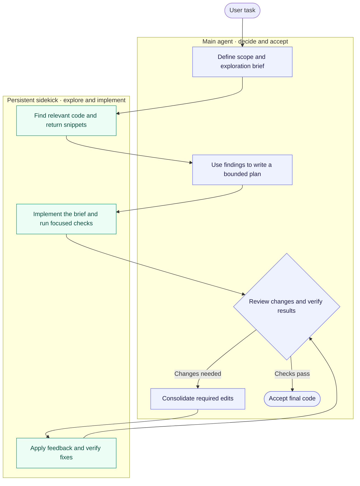

# Fusion

An independent implementation of Cognition's Fusion orchestration pattern as a Codex plugin.
A capable main agent plans and reviews. One persistent sidekick implements bounded briefs and verifies the results.
This project is not affiliated with Cognition. It does not include the Devin binary or proprietary prompts.

## How it works



The main agent owns planning, review, and acceptance. The sidekick explores code, implements changes, and runs focused checks.
They exchange concise briefs and results. Review feedback goes back in one consolidated handoff.
The main agent verifies the final changes before accepting them; critical analysis stays with the main agent.

## Install and set up

```sh
codex plugin marketplace add nahuelb/codex-fusion-plugin
codex plugin add fusion@fusion-marketplace
```

Git must have access to the repository. Start a fresh Codex task, then send:

```text
Use $setup-fusion to set up Fusion.
```

Setup creates your live model file if missing and preserves existing choices.
Then use `Use $fusion to implement <task>`. The namespaced skills are `fusion:setup-fusion` and `fusion:fusion`.
See [installation](docs/installation.md) for prerequisites, updates, local checkouts, and optional hooks.

## Model settings

Edit `$CODEX_HOME/plugins/fusion/models.json` at any time.
When `CODEX_HOME` is unset, the path is `~/.codex/plugins/fusion/models.json`:

```json
{
  "version": 1,
  "lead": {
    "use_current_model": true,
    "model": "gpt-6-astra",
    "reasoning_effort": "medium"
  },
  "sidekick": {
    "model": "gpt-5.6-luna",
    "reasoning_effort": "xhigh"
  }
}
```

The current conversation keeps its model by default.
A caller that delegates a Fusion run uses the configured lead model and effort.
Set `use_current_model` to false to request a delegated lead even from a direct invocation.

Sidekick model or effort changes apply at the next handoff. The running handoff finishes before agent replacement.
Unchanged settings reuse the existing agent. New agents receive the accepted-state summary.
Lead changes apply to the next delegated run. No setting changes an in-flight model call.
No reinstall is needed for JSON edits. The plugin reads the external file on every dispatch.
Invalid JSON blocks new dispatches instead of silently selecting another model.
Save through an atomic file replacement to avoid a temporary parse error during editing.

Use `FUSION_MODELS_FILE` on the Codex host for another absolute registry path.
The initializer preserves an existing valid file. Model availability remains a runtime check.
See [delegated entry](skills/fusion/references/delegated-entry.md) for integration with another conversation.

Hooks require Codex hook trust. Review and enable them through `/hooks` when requested by Codex.
The workflow still operates as instructions without hooks. Hooks do not bypass approvals or verification gates.
Ask to stop Fusion to close and release the sidekick and deactivate the current session.

## Session usage

Ask `Use $fusion-usage to analyze this session`, or supply an exact Codex session ID.
The skill reads local recorded usage and reports lead, confirmed sidekick, and unclassified subagent totals.
It includes closed or replaced agents when their logs remain available. It does not label every subagent as a sidekick.
This is an on-demand snapshot, not a background tracker or dollar-cost calculation.

For command-line use from a checkout:

```sh
python3 scripts/token_usage.py
python3 scripts/token_usage.py --session <exact-thread-id>
```

The default uses `CODEX_THREAD_ID`. Supply `--codex-home` for another local log directory.
Use repeated `--sidekick-id <id>` only for known sidekicks. Explicit rollout paths remain supported below.
Missing or remote logs remain unavailable; the helper never selects the globally latest session.

## Included

- Fusion workflow and setup skills, runtime adapter, brief format, and sidekick contract.
- Opt-in session state and a single-sidekick registration constraint.
- Advisory reminders after edits, on follow-up input, and on resume/compaction.
- Live lead/sidekick JSON registry and explicit spawn arguments, without model-pinned custom agents.
- Read-only token accounting over explicitly selected Codex rollout files.
- Offline state and accounting tests.

```sh
python3 scripts/model_config.py show
python3 scripts/fusion.py status
python3 scripts/fusion.py dispatch
python3 scripts/token_usage.py --lead /absolute/lead.jsonl --sidekick /absolute/sidekick.jsonl
python3 -m unittest discover -s tests -v
```

State uses `/tmp/codex-fusion-<uid>/state.sqlite3` on macOS/Linux, or the user temporary directory on Windows.
The temporary location supports standard workspace sandboxes. System cleanup can remove activation state.
Override with `FUSION_STATE_DIR` on the Codex host so both commands and hooks inherit the same location.
Setting that variable only inside one tool command does not configure the hook process.
Commands read `CODEX_THREAD_ID`, or accept `--session <actual-id>` after the subcommand.
The state registry does not control native agent processes. Close a sidekick before releasing its ID.

## Fidelity and limits

The core handoff loop, task carve-outs, focused verification, and consolidated review come from the recovered Fusion design.
Codex provides the native agent runtime. The plugin does not recreate Devin's backend or model routing.
The hooks provide reminders, not mandatory delegation or an access-control boundary.
The registry prevents conflicting registrations; it cannot prevent an agent from spawning an unregistered agent.
Subagent conversation continuity is distinct from shell or process continuity. Persistent services remain main-agent-owned.
Cost savings and task quality have not been benchmarked. Token reports do not infer subscription quota or dollar cost.

See [evidence and adaptations](docs/evidence.md) and [evaluation protocol](docs/evaluation.md).

## Local development

Use a local checkout as your development marketplace source; see [installation](docs/installation.md).
A personal marketplace can instead point to a separate clean export of reviewed `main`.
That export directory is a maintainer choice, not a required installation path.
Update the cachebuster and reinstall from your configured marketplace after plugin changes.
Model settings remain in the external registry across reinstalls.
New tasks load installed updates. Existing tasks do not prove that an update loaded.

## License

[MIT](LICENSE). The workflow diagram is original to this project.
